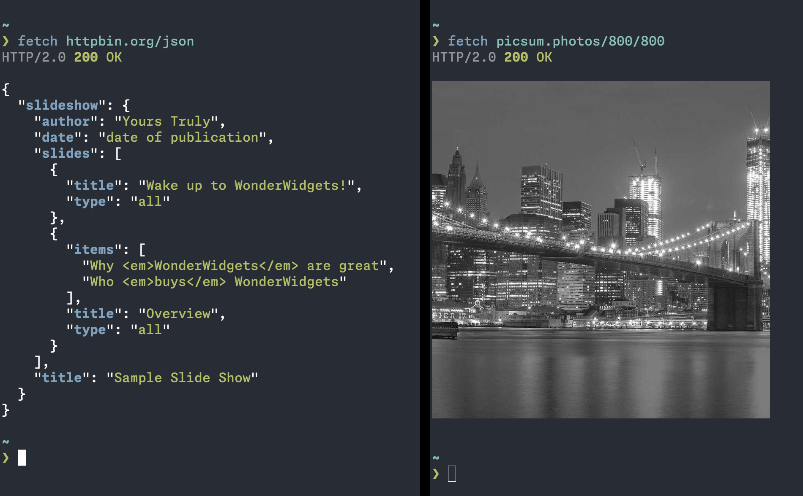

# fetch

A terminal API client for requests, streams, and network debugging.



`fetch` combines formatted HTTP responses, terminal image rendering,
WebSockets, gRPC reflection and calls, DNS inspection, TLS certificate
inspection, and request timing in one CLI.

## Features

- **Response formatting** - Automatic formatting and syntax highlighting for JSON, XML, YAML, HTML, CSS, CSV, Markdown, MessagePack, Protocol Buffers, and more
- **Image rendering** - Display images directly in your terminal
- **WebSocket support** - Bidirectional WebSocket connections with automatic JSON formatting
- **gRPC support** - Make gRPC calls with automatic reflection, discovery, and JSON-to-protobuf conversion
- **Authentication** - Built-in support for Basic Auth, Bearer Token, AWS Signature V4, and mTLS
- **Compression** - Automatic gzip, brotli, and zstd response body decompression
- **TLS inspection** - Inspect TLS certificate chains, expiry, SANs, and OCSP status
- **DNS inspection** - Inspect hostname resolution, record families, TTLs, and resolver timing
- **Timing waterfall** - Visualize request timing phases (DNS, TCP, TLS, TTFB, transfer) with a waterfall chart
- **Configuration** - Global and per-host configuration file support

## Quick Start

#### Install

```sh
# Install fetch from the shell script (macOS or Linux)
curl -fsSL https://raw.githubusercontent.com/ryanfowler/fetch/main/install.sh | bash

# Or install fetch with homebrew (macOS or Linux)
brew install ryanfowler/tap/fetch

# Or build fetch from source with Cargo
cargo install --git https://github.com/ryanfowler/fetch --locked
```

#### Usage

```sh
# Make a request for JSON
fetch httpbin.org/json

# Make a request for an image
fetch picsum.photos/1024/1024
```

## Output Model

`fetch` keeps response bodies and metadata separate: the body is written to
stdout, while status lines, headers, progress, timing, warnings, and errors are
written to stderr. This makes commands like `fetch example.com/api | jq .` work
without mixing diagnostics into the pipe.

When stdout is a terminal, supported response bodies are formatted and may open
in the pager from `$PAGER`; set `NO_PAGER` or use `--pager off` to write
directly. If `$PAGER` is unset, fetch falls back to `less -FIRX` and honors
`$LESS` instead of adding default flags. When stdout is redirected or piped,
formatting turns off by default; use `--format on` to force formatted output in
a pipe. Binary-looking responses are not printed to a terminal unless you
explicitly choose an output path with `-o file`, force raw stdout with
`-o - > file`, or disable terminal image rendering with `--image off`.

## Examples

### Everyday API Work

```sh
# POST JSON and format the response automatically
fetch -j '{"name":"Ada"}' https://httpbin.org/post

# Reuse cookies across requests with a named session
fetch --session api -j '{"user":"me"}' https://example.com/login
fetch --session api https://example.com/dashboard

# Convert a curl command into a fetch request
fetch --from-curl 'curl -H "Authorization: Bearer TOKEN" https://api.example.com'

# Show response headers, request+response headers, or full connection details
fetch -v https://example.com
fetch -vv https://example.com
fetch -vvv https://example.com
```

### DNS, TLS, and Timing Diagnostics

```sh
# Inspect DNS records, TTLs, resolver backend, and lookup duration
fetch --inspect-dns example.com

# Run the same DNS inspection through DNS-over-HTTPS
fetch --inspect-dns --dns-server https://1.1.1.1/dns-query example.com

# Inspect the TLS certificate chain, expiry, SANs, OCSP, ALPN, and cipher suite
fetch --inspect-tls https://example.com

# Inspect the HTTP/3 QUIC/TLS path
fetch --inspect-tls --http 3 https://cloudflare.com

# Show a request timing waterfall for DNS, TCP, TLS, TTFB, and body transfer
fetch --timing https://example.com
```

### WebSocket and gRPC

```sh
# Connect to a WebSocket and send an initial JSON message
fetch wss://echo.websocket.events -j '{"type":"ping"}'

# Discover gRPC services using reflection
fetch --grpc-list https://localhost:50051

# Describe a gRPC service, method, or message
fetch --grpc-describe grpc.health.v1.Health http://127.0.0.1:50051

# Make a gRPC call with JSON-to-protobuf conversion
fetch --grpc -j '{"service":""}' \
  http://127.0.0.1:50051/grpc.health.v1.Health/Check
```

### Terminal-Friendly Output

```sh
# Render images directly in supported terminals
fetch https://httpbin.org/image/png

# Disable the pager for scripts or small responses
fetch --pager off https://httpbin.org/json

# Save a response and copy the decoded body to the clipboard
fetch --copy -o response.json https://httpbin.org/json

# Preserve response bytes for compressed downloads
fetch --compress off -o archive.tar.gz https://example.com/archive.tar.gz
```

## Documentation

- **[Getting Started](docs/getting-started.md)** - Installation, first steps, and basic concepts
- **[CLI Reference](docs/cli-reference.md)** - Complete reference for all command-line options
- **[Configuration](docs/configuration.md)** - Configuration file format and options
- **[Authentication](docs/authentication.md)** - Basic, Bearer, AWS SigV4, and mTLS
- **[Request Bodies](docs/request-bodies.md)** - JSON, XML, forms, multipart, and file uploads
- **[Output Formatting](docs/output-formatting.md)** - Supported content types and formatting options
- **[Image Rendering](docs/image-rendering.md)** - Terminal image protocols and formats
- **[WebSocket](docs/websocket.md)** - Bidirectional WebSocket connections
- **[gRPC](docs/grpc.md)** - Making gRPC requests with Protocol Buffers
- **[Advanced Features](docs/advanced-features.md)** - DNS, proxies, TLS, HTTP versions, and more
- **[Troubleshooting](docs/troubleshooting.md)** - Common issues, debugging, and exit codes

## License

`fetch` is released under the [MIT License](LICENSE).
