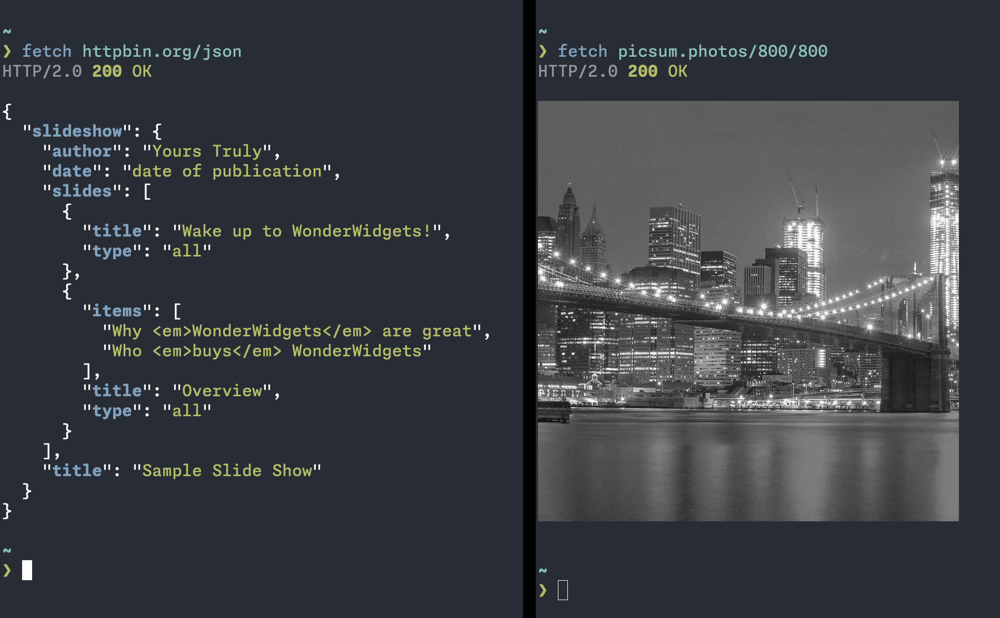

# fetch

A modern HTTP(S) client for the command line, implemented in Go.



## Features

- **Response formatting** - Automatic formatting and syntax highlighting for JSON, XML, YAML, HTML, CSS, CSV, Markdown, MessagePack, Protocol Buffers, and more
- **Image rendering** - Display images directly in your terminal
- **WebSocket support** - Bidirectional WebSocket connections with automatic JSON formatting
- **gRPC support** - Make gRPC calls with automatic reflection, discovery, and JSON-to-protobuf conversion
- **Authentication** - Built-in support for Basic Auth, Bearer Token, AWS Signature V4, and mTLS
- **Compression** - Select automatic, Brotli, gzip, zstd, or disabled response decoding
- **TLS inspection** - Inspect TLS certificate chains, expiry, SANs, and OCSP status
- **DNS inspection** - Inspect hostname resolution, record families, TTLs, and resolver timing
- **Timing waterfall** - Visualize request timing phases (DNS, TCP, TLS, TTFB, transfer) with a waterfall chart
- **Configuration** - Global and per-host configuration file support
- **Article extraction** - Extract readable HTML as Markdown with YAML frontmatter
- **HAR recording** - Capture the final exchange in a bounded HAR 1.2 sidecar
- **Automatic HTTP/3 and ECH** - Use HTTPS/SVCB discovery with explicit downgrade controls
- **Agent Skill** - Print or install the portable skill offline for supported agents

## Quick Start

#### Install

```sh
# Install fetch from the verified Go release archive (macOS or Linux)
curl -fsSL https://raw.githubusercontent.com/ryanfowler/fetch/main/install.sh | bash
# The installer verifies the SHA-256 sidecar and atomically replaces fetch.

# Or install fetch with homebrew (macOS or Linux)
brew install ryanfowler/tap/fetch

# Or install fetch with Go
go install github.com/ryanfowler/fetch@latest
```

#### Usage

```sh
# Make a request for JSON
fetch httpbin.org/json

# Make a request for an image
fetch picsum.photos/1024/1024
```

## Documentation

- **[Documentation index](docs/index.md)** - Feature and maintainer guide index
- **[Getting Started](docs/getting-started.md)** - Installation, first steps, and basic concepts
- **[CLI Reference](docs/cli-reference.md)** - Complete reference for all command-line options
- **[Configuration](docs/configuration.md)** - Configuration file format and options
- **[Authentication](docs/authentication.md)** - Basic, Bearer, AWS SigV4, and mTLS
- **[Request Bodies](docs/request-bodies.md)** - JSON, XML, forms, multipart, and file uploads
- **[Output Formatting](docs/output-formatting.md)** - Supported content types and formatting options
- **[Image Rendering](docs/image-rendering.md)** - Terminal image protocols and formats
- **[WebSocket](docs/websocket.md)** - Bidirectional WebSocket connections
- **[gRPC](docs/grpc.md)** - Making gRPC requests with Protocol Buffers
- **[Advanced Features](docs/advanced-features.md)** - DNS, proxies, TLS, HTTP versions, and more
- **[Encrypted ClientHello](docs/ech.md)** - ECH modes, discovery, and downgrade safety
- **[Article Extraction](docs/article.md)** - Readable HTML and Markdown output
- **[HAR Recording](docs/har.md)** - Bounded exchange capture and sensitivity rules
- **[Self-update and Installer](docs/updates.md)** - Verified Go artifacts and atomic replacement
- **[Agent Skill](docs/agent-skill.md)** - Offline print, install, and uninstall workflow
- **[Shell Completion](docs/completions.md)** - Bash, Zsh, Fish, and PowerShell
- **[Limits and Safety](docs/limits.md)** - Resource caps and security invariants
- **[Troubleshooting](docs/troubleshooting.md)** - Common issues, debugging, and exit codes

## License

`fetch` is released under the [MIT License](LICENSE). See the [documentation index](docs/index.md) for the complete user and maintainer reference.
