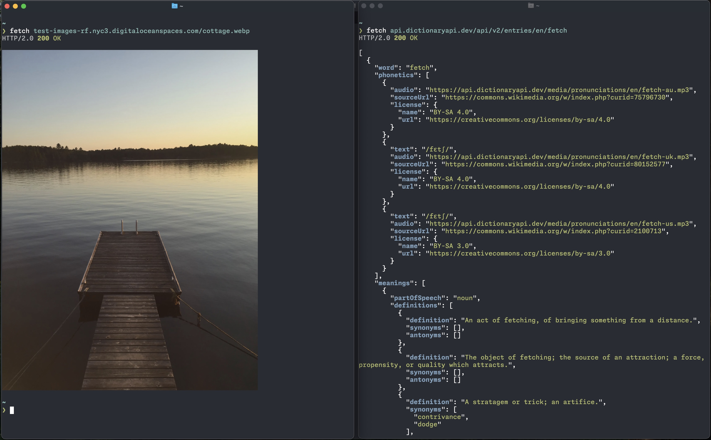

# fetch

`fetch` is a modern, high-level HTTP(S) client for the command line.



### Features include:

- **Response formatting**: automatically formats and colors output (json, html, csv, msgpack, protobuf, xml, etc.)
- **Image rendering**: render images directly in your terminal
- **Compression**: automatic gzip and zstd response body decompression
- **Authentication**: support for Basic Auth, Bearer Token, and AWS Signature V4
- **Form body**: send multipart or urlencoded form bodies
- **Editor integration**: use an editor to modify the request body
- **Configuration**: global and per-host configuration
- _and more!_

---

## Installation

You can install `fetch` using an installation script, by compiling from source,
or from pre-built binaries.

### Installation Script

For macOS or Linux, download and run the [install.sh](./install.sh) script:

```sh
curl -fsSL https://raw.githubusercontent.com/ryanfowler/fetch/main/install.sh | bash
```

### Building from Source

Ensure you have Go installed, then run:

```sh
go install github.com/ryanfowler/fetch@latest
```

### Pre-built Binaries

Visit the [GitHub releases page](https://github.com/ryanfowler/fetch/releases)
to download the binary for your operating system.

### Updating

Once installed, you can update the fetch binary in-place by running:

```sh
fetch --update
```

Or you can let the application auto-update by including the following setting in
your [configuration file](#Configuration):

```ini
auto-update = true
```

---

## Usage

To make a GET request to a URL and print the status code to stderr and the response body to stdout:

```sh
fetch example.com
```

<pre><code><span style='opacity:0.67'>HTTP/1.1</span> <span style='color:green'><b>200</b></span> <span style='color:green'>OK</span>

{
  &quot;<span style='color:blue'><b>name</b></span>&quot;: &quot;<span style='color:green'>example</span>&quot;,
  &quot;<span style='color:blue'><b>value</b></span>&quot;: 42
}
</code></pre>

For complete usage documentation including all available options and advanced features, see [USAGE.md](docs/USAGE.md).

---

## Configuration

`fetch` can be configured using a file with an ini-like format. Configuration files support both global settings and host-specific configurations.

### File Locations

`fetch` searches for configuration files in the following order:

- the file location specified with the `-c` or `--config` flag
- on Windows at `%AppData%\fetch\config`
- on Unix-like systems at `$XDG_CONFIG_HOME/fetch/config` or `$HOME/.config/fetch/config`

### Configuration Precedence

Settings are applied in the following order of precedence:

- CLI flags (highest priority)
- domain-specific configuration
- global configuration
- default values (lowest priority)

### Basic Example

```ini
# Global settings
color = on
format = on
timeout = 30

# Domain-specific settings
[api.example.com]
header = X-API-Key: your-api-key
timeout = 10
```

For complete configuration documentation including all available options, file format details, and advanced examples, see [CONFIG.md](docs/CONFIG.md).

---

## License

`fetch` is released under the [MIT License](LICENSE).
